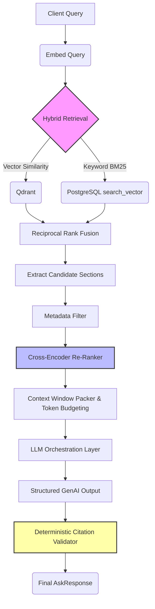

# PageIndex KnowledgeOS

[](https://www.python.org/downloads/)
[](https://fastapi.tiangolo.com)
[](https://qdrant.tech/)
[](https://www.postgresql.org/)
[](https://www.docker.com/)

**PageIndex KnowledgeOS** is an enterprise-grade, hierarchical Retrieval-Augmented Generation (RAG) system built to ingest deeply structured documents and generate high-precision, citation-backed LLM responses.

Instead of flat, lossy text chunks, PageIndex preserves the structural relationships intrinsic to multi-page documents (`Document` → `Page` → `Section`). It enforces rigorous source alignment through hybrid retrieval, cross-encoder re-ranking, intelligent context window packing, and deterministic citation validation.

---

## ⚡ Core Features

- **Hierarchical RAG Pipeline**: Data ingested natively mapped to Document, Page, and Section entities. PostgreSQL serves as the relational source of truth, uniquely indexing vector embeddings in Qdrant.
- **Hybrid Retrieval Signal Fusion**: 
  - **Dense Search**: Fast, semantic similarity queries via Qdrant.
  - **Sparse Search**: Highly precise keyword matching via PostgreSQL `tsvector` and BM25 scoring.
  - **Reciprocal Rank Fusion**: RRF merges the dense and sparse signals to surface the absolute best context.
- **Cross-Encoder Re-Ranking**: Optionally pass candidates through a `sentence-transformers` cross-encoder to prune false-positive sections before sending them to the LLM.
- **Intelligent Context Packing**: Greedily fills the LLM context window based on relevance thresholds, eliminating duplicate sections natively, and strictly respecting a configurable token budget.
- **Deterministic Citation Validation**: Every LLM answer is forced to cite `[Document X, Page Y]`. The system programmatically cross-validates LLM-generated citations against the actual provided context window, emitting a deterministic `citation_integrity` score.
- **Rich Metadata Filtering**: Tightly scope search queries filtering by `document_ids`, explicit `page_range`, and `filename`.

## 🏗️ Architecture



## 🛠️ Technology Stack

- **API Framework**: FastAPI ([Pydantic V2](https://docs.pydantic.dev/), [Uvicorn](https://www.uvicorn.org/))
- **Relational DB**: PostgreSQL + SQLAlchemy ORM (Hierarchy mappings, BM25 indices)
- **Vector DB**: Qdrant (Dense embedding similarity)
- **Embedding Provider**: `sentence-transformers/all-MiniLM-L6-v2`
- **Re-Ranking Model**: `cross-encoder/ms-marco-MiniLM-L-6-v2`
- **LLM Engine**: Google [Gemini GenAI APIs](https://ai.google.dev/) (gemini-2.0-flash / gemini-2.0-pro-exp)
- **Infrastructure**: Docker Compose (Network isolation, localized deployments)
- **PDF Extraction**: PyMuPDF (`fitz`)

---

## 🚀 Getting Started

### Prerequisites
- Python 3.9+ 
- Docker Engine & Docker Compose
- A Google GenAI API Key

### 1. Environment Setup

Copy the environment template and configure your keys:

```bash
cp .env.example .env

# Edit .env and supply your Gemini API token:
LLM_API_KEY=YOUR_GEMINI_API_KEY
```

Create a virtual environment and load dependencies:

```bash
python -m venv .venv
source .venv/bin/activate
pip install -r requirements.txt
```

### 2. Boot Infrastructure

Spin up the local PostgreSQL and Qdrant instances:

```bash
docker compose up -d
```

### 3. Initialize Databases

Run the initialization script to configure the Qdrant collections and PostgreSQL schema mapping:

```bash
python scripts/init_qdrant.py
```

### 4. Start the Application

Start the local Uvicorn ASGI server:

```bash
uvicorn app.main:app --reload
```

Your API is now responding at `http://localhost:8000`. Full OpenAPI interactive documentation is available at `http://localhost:8000/docs`.

---

## 💻 API Usage Examples

### 1. Ingesting Documents
`POST /api/v1/ingest`

Upload a PDF file to begin the parsing pipeline (Document → Pages → Sections → Embeddings).

```bash
curl -X 'POST' \
  'http://localhost:8000/api/v1/ingest' \
  -H 'accept: application/json' \
  -H 'Content-Type: multipart/form-data' \
  -F 'file=@sample_report.pdf'
```

### 2. Knowledge Retrieval and Answering
`POST /api/v1/ask`

Run a fully augmented request across your corpus. Optionally attach metadata filters.

```json
// Request
{
  "query": "What are the core pillars of the 2026 revenue strategy?",
  "top_k": 7,
  "filters": {
    "filename_contains": "strategy",
    "page_range": [1, 15]
  }
}

// Response
{
  "answer": "According to the financial breakdown, the core pillars involve...",
  "citations": [
    {
      "document_name": "quarterly_strategy_deck.pdf",
      "page_number": 4,
      "section_title": "3.1 Revenue Targets",
      "text_snippet": "The 2026 revenue strategy explicitly revolves around three major pillars..."
    }
  ],
  "citation_integrity": 1.0,
  "unverified_citations": []
}
```

---

## ⚙️ Core Configuration (`.env`)

Tweak the parameters of the intelligence suite via standard environment variables:

| Variable | Default Value | Description |
|----------|---------------|-------------|
| `BM25_ENABLED` | `True` | Activates sparse keyword retrieval within the pipeline. |
| `BM25_WEIGHT` | `0.3` | Score weighting given to sparse retrieval during RRF fusion. |
| `VECTOR_WEIGHT` | `0.7` | Score weighting given to dense retrieval during RRF fusion. |
| `RERANKER_ENABLED` | `False` | Toggles the CPU-intensive cross-encoder stage. |
| `CONTEXT_TOKEN_BUDGET`| `3000` | Hard cap on the number of context tokens fed to the LLM. |
| `MIN_RELEVANCE_THRESHOLD` | `0.1` | RRF fusion score threshold before discarding a context chunk. |
| `LLM_PROVIDER` | `gemini` | Configures the underlying LLM inference provider (Mock, Gemini). |

---

## 📂 Project Tree

```text
├── app/
│   ├── api/v1/         # Endpoints (ingest, ask)
│   ├── core/           # Pydantic Settings & Lifespans
│   ├── db/             # PG/SQLAlchemy bounds and Qdrant Clients
│   ├── models/         # Canonical schemas (Document, Page, Section)
│   ├── schemas/        # Pydantic Req/Res structures
│   └── services/       # Core business logic:
│       ├── bm25_retriever.py    # PG TSVector Keyword Search
│       ├── citation_validator.py# Post-Gen Integrity Scoring
│       ├── context_packer.py    # Adaptive Budget Thresholding
│       ├── embeddings.py        # CPU MiniLM Embedding Client
│       ├── fusion.py            # RRF Ranking Algorithm
│       ├── ingestion.py         # DB writes & Qdrant Upserts
│       ├── llm.py               # Prompt formatting and GenAI invoke
│       ├── pdf_processor.py     # Hierarchical Document Extractor
│       ├── reranker.py          # Lazy loaded Cross-Encoder
│       └── retrieval.py         # Main Search Pipeline orchestrator
├── tests/              # End-to-End integration tests
└── scripts/            # Environment & Qdrant setup scripts
```

## 📜 License

This project is licensed under the MIT License.
